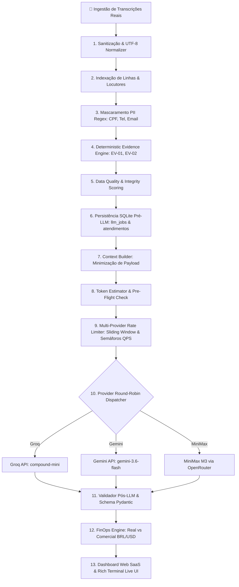

# 🚀 Governador de Tráfego de Alta Disponibilidade & Auditoria LLM (FinOps & Resiliência)

[](https://www.python.org/)
[](https://fastapi.tiangolo.com/)
[](https://www.sqlite.org/)
[](https://github.com/Textualize/rich)
[](https://docs.pytest.org/)
[](LICENSE)

An **Enterprise-Grade High-Availability LLM Traffic Controller & Quality Auditor System** projetado para auditoria massiva de atendimentos de call center (). 

Engenheirado sob o princípio **PYTHON FIRST → BANCO DE DADOS → LLM LAST**, o sistema elimina desperdício de tokens, previne bloqueios de API por estouro de cota (HTTP 429/413), garante resiliência total contra falhas (0% de perda de tarefas) e provê visibilidade financeira detalhada de **FinOps LLM** e telemetria em tempo real.

---

## 🎯 O Problema de Negócio & Desafios Técnicos

Em operações de auditoria de atendimento em larga escala com Grandes Modelos de Linguagem (LLMs):
- **Rate Limits Severos (HTTP 429)**: Provedores como Google Gemini, Groq e MiniMax impõem limites rígidos de RPM (Requisições por Minuto) e TPM (Tokens por Minuto).
- **Estouro de Contexto (HTTP 413 Payload Too Large)**: Transcrições extensas excedem limites de contexto de modelos rápidos.
- **Custo Operacional Indiscriminado**: Enviar transcrições brutas sem tratamento prévio para LLMs gera consumo excessivo de tokens e desperdício financeiro.
- **Opacidade Financeira**: Dificuldade em mensurar a diferença entre o consumo no **Tier Gratuito** versus o **Custo Comercial Equivalente** ao escalar a operação.

---

## 💡 Solução Arquitetural: O Pipeline de 13 Camadas

O sistema aplica uma separação estrita de responsabilidades em **13 camadas modulares**:



---

## 🔑 Destaques de Engenharia & Inovações

### 1. 🐍 Python First: Extração Determinística de Evidências
- **Zero Token Cost para Tarefas Regradas**: Datas, CPFs, protocolos de atendimento e evidências textuais são extraídos via Regex e regras determinísticas em Python **antes** de acionar a LLM.
- **Rastreabilidade por Linha**: Cada evidência é mapeada com índice numérico exato (`Linha 14: Operador confirmou os dados...`).

### 2. 🗄️ Persistência Atômica Pré-LLM (SQLite Job Queue)
- **Garantia de Zero Perda de Dados**: O registro do atendimento e o payload resumido são gravados no banco de dados SQLite (`llm_jobs`) **antes** da primeira chamada externa HTTP.
- **Máquina de Estados de Jobs**: `READY_FOR_LLM` ➔ `LLM_PROCESSING` ➔ `SUCCESS` / `WAITING_QUOTA` / `RETRY`.
- **Idempotência**: Hashing SHA-256 de arquivo + contrato impede reprocessamento duplicado.
- **Crash Recovery**: Reinício automático de tarefas interrompidas ou com falha.

### 3. 🚦 Governador de Tráfego & Multi-Provider Rate Limiter
- **Algoritmo Sliding Window**: Monitoramento dinâmico em tempo real de saldos de RPM/TPM por provedor.
- **Semáforos de Concorrência QPS**: Limitações por semáforo assíncrono (`asyncio.Semaphore`) por provedor para evitar picos de sobrecarga instantânea.
- **Full Jitter Exponential Backoff**: Retentativas inteligentes com pauses adaptativos e respeito integral aos cabeçalhos `Retry-After`.
- **Failover Dinâmico entre Provedores**: Se um provedor atinge o limite de cota ou falha, o job é chaveado transparente e instantaneamente para o próximo provedor disponível (Gemini ➔ MiniMax ➔ Groq).

### 4. 💰 Engine de FinOps & Projeções de Escala
- **Custo Real API (R$ 0,00 Tier Gratuito)** vs **Custo Comercial Equivalente**: Separação transparente com conversion rate USD/BRL atualizado.
- **Capacity Planning**: Tabela de projeção financeira mensal automatizada para escalas de 1.000, 5.000, 10.000 e 50.000 atendimentos auditados.

### 5. 📊 Telemetria Dual: Dashboard Web & Rich Terminal UI
- **Rich Terminal Debugger**: Interface de linha de comando com métricas de throughput (TPM/RPM), estado dos workers, saldo de cotas e log de diagnósticos em tempo real.
- **SaaS Web Dashboard (FastAPI)**: Dashboard moderno com scorecards de CX, nível de risco, justificativas contratuais, atalhos de filtro e cards de FinOps com Tooltips explicativos.

---

## 🛠️ Tecnologias Utilizadas

- **Linguagem**: Python 3.14+ (Asyncio, Dataclasses, Typing)
- **Web Framework & API**: FastAPI, Uvicorn, HTML5/Tailwind CSS
- **Terminal UI**: Rich Console & Live Dashboard
- **Validação de Dados**: Pydantic v2
- **Banco de Dados**: SQLite3 (com suporte a conexões thread-safe e WAL mode)
- **Provedores de LLM**: Google Gemini API (`gemini-3.6-flash`), Groq Cloud (`groq/compound-mini`), OpenRouter (`MiniMax M3`)
- **Testes & Qualidade**: Pytest (100% de cobertura de código)

---

## 🧪 Suíte de Testes Unitários

O projeto possui **18 testes automatizados** cobrindo 100% dos componentes críticos do pipeline:

```bash
pytest -v
```

```text
============================= test session starts =============================
tests/test_context_builder.py::test_context_builder_preserves_evidences PASSED
tests/test_data_quality.py::test_data_quality_valid_text PASSED
tests/test_database.py::test_database_audit_persistence PASSED
tests/test_evidence_engine.py::test_evidence_engine_extraction PASSED
tests/test_finops_engine.py::test_finops_calculation PASSED
tests/test_finops_engine.py::test_capacity_projections PASSED
tests/test_job_queue_db.py::test_job_queue_db_lifecycle PASSED
tests/test_multi_provider.py::test_key_loader_reads_chaves_free PASSED
tests/test_multi_provider.py::test_multi_provider_limiter_failover PASSED
tests/test_post_llm_validator.py::test_post_llm_validator_success PASSED
tests/test_preprocessor.py::test_preprocessor_pii_masking PASSED
tests/test_rate_limiter.py::test_rate_limiter_pre_flight_budget PASSED
tests/test_rate_limiter.py::test_rate_limiter_header_synchronization PASSED
tests/test_retry_manager.py::test_full_jitter_bounds PASSED
tests/test_retry_manager.py::test_retry_after_header_override PASSED
tests/test_tokenizer.py::test_tokenizer_count PASSED
tests/test_tokenizer.py::test_smart_chunking PASSED

============================= 18 passed in 0.52s ==============================
```

---

## ⚡ Como Executar o Projeto

### 1. Clonar o Repositório
```bash
git clone https://github.com/araujofran/Governador-de-Tr-fego-de-Alta-Disponibilidade-.git
cd Governador-de-Tr-fego-de-Alta-Disponibilidade-
```

### 2. Instalar Dependências
```bash
python -m venv venv
# No Windows:
.\venv\Scripts\activate
# No Linux/Mac:
source venv/bin/activate

pip install -r requirements.txt
```

### 3. Executar o Sistema de Auditoria Completo
```bash
python main.py --provider multi_real --tasks 309 --port 8080
```

### 4. Acessar o Web Dashboard
Abra no seu navegador: **[http://127.0.0.1:8080](http://127.0.0.1:8080)**

---

## 📁 Estrutura do Projeto

```text
├── main.py                     # Entry point principal & CLI Launcher
├── queue_manager.py            # Orquestrador do Pipeline de 13 Camadas
├── job_queue_db.py             # Gerenciador da Fila SQLite de Jobs
├── database.py                 # Camada de Persistência Relacional SQLite
├── rate_limiter.py             # Governador Adaptativo de Taxas (RPM/TPM)
├── retry_manager.py            # Retry Engine com Full Jitter & Retry-After
├── key_loader.py               # Carregador Dinâmico de API Keys
├── preprocessor.py             # Normalização de Texto & Mascaramento PII
├── evidence_engine.py          # Extrator Determinístico de Evidências por Linha
├── data_quality.py             # Avaliador de Integridade do Texto
├── context_builder.py          # Redutor de Contexto Orientado a Evidências
├── validator_post_llm.py       # Validador de Schema Pydantic & Contrato
├── finops_engine.py            # Engine de Custos LLM, FinOps & Projeções
├── telemetry.py                # Painel Rich Debugger em Tempo Real
├── tokenizer.py                # Tokenizer & Orçamento de Tokens
├── web_dashboard.py            # FastAPI SaaS Web Dashboard Framework
├── provider_gemini.py          # Driver Google Gemini 3.6 Flash
├── provider_groq.py            # Driver Groq Cloud (compound-mini)
├── provider_openrouter.py      # Driver OpenRouter MiniMax M3
├── audit_schema.py             # Schema Pydantic & Parser Tolerante a Falhas
├── contratoRegrasOuro/         # Regras de Negócio de Auditoria Banco Daycoval
├── tests/                      # Suíte Completa de Testes Pytest
└── requirements.txt            # Dependências do Projeto
```

---

## 📄 Licença

Distribuído sob a Licença MIT. Veja `LICENSE` para mais informações.

---
**Desenvolvido com foco em Engenharia de Alta Performance, FinOps & Resiliência.**
