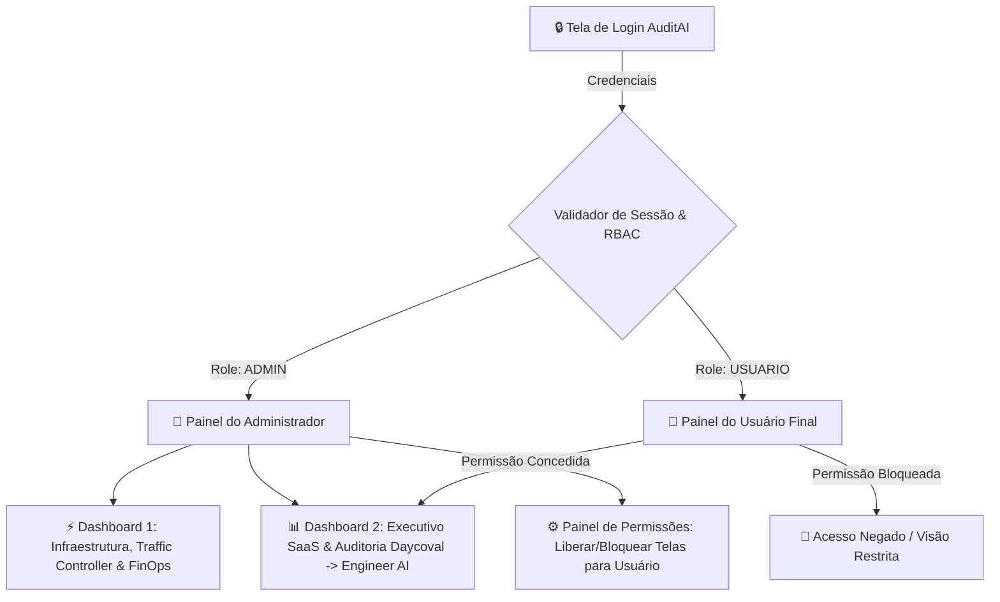

# Implementation Plan - Sistema AuditAI: Autenticação, RBAC, Dashboard Executivo SaaS & Rebranding

## 📌 Visão Geral & Requisitos do Usuário

Conforme solicitado, o sistema passará por uma reformulação completa na camada de apresentação e acesso:

1. **Rebranding Completo**: 
   - Substituição total da marca "Banco Daycoval" por **"Banco Engineer AI"** em toda a aplicação, prompts de auditoria, logs e dashboards.
2. **Tela de Login 'AuditAI' (Baseada no Mockup Enviado)**:
   - Implementação fiel ao layout da imagem fornecida pelo usuário (`AuditAI - Inteligência que protege o seu negócio`).
   - Lado esquerdo: Hero visual escuro com destaques de valor, card de atendimento analisado, cotação e tipografia fluida.
   - Lado direito: Card de autenticação com gradiente dourado (`Entrar →`), suporte a atalhos e rodapé corporativo.
3. **Controle de Acesso Baseado em Funções (RBAC)**:
   - **Role `admin`** (Senha: `admin1` / Login: `admin@engineer.ai` ou `admin`):
     - Acesso total ao **Dashboard de Infraestrutura, Tokens & FinOps** (Interface Atual).
     - Acesso total ao novo **Dashboard Executivo SaaS & Auditoria** (Interface Inspirada no Behance).
     - **Painel de Gestão de Acessos**: O Admin pode ligar/desligar quais dashboards e visões cada usuário tem permissão para visualizar.
   - **Role `usuario`** (Senha: `usuario1` / Login: `usuario@engineer.ai` ou `usuario`):
     - Acessa estritamente as visões e dashboards que o Admin liberou para ele.

---

## 🖼️ Referência da Tela de Login (Mockup Enviado)

O login seguirá a estrutura e o design system do mockup enviado:

---

## 🎨 Especificações da Arquitetura & Telas

### 1. Sistema de Autenticação & Sessão
- Autenticação baseada em Cookie de Sessão / Token JWT mantido no FastAPI (`web_dashboard.py`).
- Credenciais Pré-Configuradas (expansível via banco):
  - **Admin**: `admin@engineer.ai` (ou `admin`) / Senha: `admin1`
  - **Usuário**: `usuario@engineer.ai` (ou `usuario`) / Senha: `usuario1`
- Tabela SQLite `usuarios_permissoes` para persistir quais abas e dashboards o Admin liberou para o Usuário.

### 2. Dashboard 1: Infraestrutura & FinOps (Visão Desenvolvedor / Admin)
- Mantém todas as métricas em tempo real (Workers, Tokens, Limites RPM/TPM por Provedor, Custo Real vs Comercial, Tabela de Projeção Mensal).
- Exclusivo do `admin` por padrão.

### 3. Dashboard 2: Executivo SaaS (Inspirado no Behance LMS SaaS)
- Visão focada no negócio para o **Banco Engineer AI**:
  - Scorecard de Atendimentos (CX Score 0-100, Qualidade Técnica, Tom Comportamental, Resolutividade).
  - Análise de Risco & Causa Raiz com Citação Literal de Evidências.
  - Inspetor de Transcrição com realce de linha e marcas de evidência.
  - Filtros avançados por Nível de Risco, Operador e Data.

### 4. Alternador de Interfaces (Header Switcher)
- Quando logado como `admin`, o usuário vê uma barra de navegação superior para alternar facilmente entre o **Dashboard de Infraestrutura** e o **Dashboard Executivo SaaS**, além do botão **Gestão de Permissões**.

---

## 🛠️ Modificações Propostas no Código

#### [MODIFY] [contratoRegrasOuro/1-promptAnaliseAtendimentos.txt](file:///C:/Users/fferr/Desktop/projetoRATE/contratoRegrasOuro/1-promptAnaliseAtendimentos.txt)
- Substituir todas as menções de "Banco Daycoval" para **"Banco Engineer AI"**.

#### [MODIFY] [audit_schema.py](file:///C:/Users/fferr/Desktop/projetoRATE/audit_schema.py) & [provider_gemini.py](file:///C:/Users/fferr/Desktop/projetoRATE/provider_gemini.py)
- Atualizar descrições padrão para utilizar **"Banco Engineer AI"**.

#### [MODIFY] [database.py](file:///C:/Users/fferr/Desktop/projetoRATE/database.py)
- Criar tabelas `users` e `user_permissions` para controle dinâmico de acesso por role e permissões de visibilidade de dashboards.

#### [MODIFY] [web_dashboard.py](file:///C:/Users/fferr/Desktop/projetoRATE/web_dashboard.py)
- Implementar a rota `/login` renderizando a tela **AuditAI** idêntica ao mockup.
- Criar rotas `/api/login`, `/api/logout`, `/api/me`, `/api/permissions` para controle de sessão e papéis (`admin` vs `usuario`).
- Incorporar o **Dashboard Executivo SaaS** com inspiração Behance.
- Adicionar o **Header Switcher** com controle de visibilidade baseado em roles.

---

## 📋 Plano de Verificação

### Testes Automatizados (`pytest`)
- Adicionar testes de autenticação e RBAC em `tests/test_auth_rbac.py`:
  - Testar login do `admin` (`admin1`) e validar acesso ao Dashboard Infra + Executivo.
  - Testar login do `usuario` (`usuario1`) e validar bloqueio a telas não autorizadas.
  - Testar alteração de permissão pelo admin e verificar liberação imediata para o usuário.

### Verificação Manual
1. Abrir a aplicação em `http://127.0.0.1:8080`.
2. Verificar que a tela de login **AuditAI** é renderizada com a estética idêntica ao mockup.
3. Fazer login como `admin` com a senha `admin1`:
   - Verificar a presença do alternador de telas no topo.
   - Alternar entre o Dashboard de Infraestrutura/FinOps e o Dashboard Executivo SaaS.
   - Acessar o painel de permissões e desmarcar uma tela para o perfil `usuario`.
4. Fazer logout e entrar como `usuario` com a senha `usuario1`:
   - Confirmar que apenas as telas autorizadas pelo Admin estão visíveis.
   - Verificar que a marca exibida é **Banco Engineer AI**.
